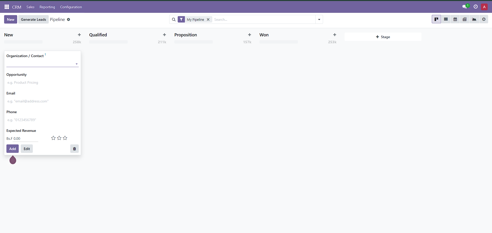
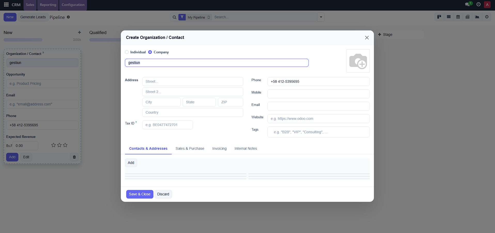

<div align="center">

# 🎨 Modern Backend Theme for Odoo 17 CE

[](https://www.odoo.com)
[](https://www.gnu.org/licenses/lgpl-3.0)
[](https://github.com/JavierASU/custom_modern_theme_Odoo-17/pulls)
[](https://github.com/JavierASU/custom_modern_theme_Odoo-17/stargazers)
[](https://github.com/JavierASU/custom_modern_theme_Odoo-17/network)
[](https://github.com/JavierASU/custom_modern_theme_Odoo-17/commits/main)
[](https://github.com/JavierASU)

**A sleek, modern UI redesign for Odoo 17 Community Edition backend.**
*Pure CSS — zero functional changes — fully reversible.*

[📦 Install](#-installation) · [📸 Screenshots](#-screenshots) · [✨ Features](#-features) · [🤝 Contributing](#-contributing)

</div>

---

## 📸 Screenshots

### Before (Odoo 17 CE Default)


### After (Modern Backend Theme)


---

## ✨ Features

This module transforms the entire Odoo 17 backend appearance while keeping **100% functionality intact**. Uninstall anytime to revert.

| Area | Improvements |
|------|-------------|
| 🎯 **Navbar** | Dark slate background, refined menu items with rounded hover effects |
| 🏠 **Home Menu** | Gradient background, app icons with scale animation on hover |
| 📋 **Control Panel** | Modern search bar with indigo focus ring, refined breadcrumbs |
| 🔘 **Buttons** | Indigo primary color, hover lift effect, smooth shadows |
| 📝 **Form Views** | Card-style sheets with rounded corners, better input styling |
| 📊 **List Views** | Uppercase headers, subtle row hover, clean borders |
| 📌 **Kanban Views** | Rounded cards with hover lift, refined quick-create |
| 🔔 **Notifications** | Rounded corners, colored left border, blur backdrop |
| 🏷️ **Badges & Tags** | Pill-shaped tags, semantic status colors |
| 📈 **Dashboards** | Cards with hover elevation, large number typography |
| 💬 **Discuss** | Refined sidebar, active state with indigo accent |
| ⚙️ **Settings** | Hover effects on setting boxes, better typography |
| 🔍 **Search Panel** | Clean sidebar with rounded active items |
| ✅ **Checkboxes** | Indigo checked state, smooth focus rings |
| 📊 **Progress Bars** | Thin gradient bars, pill-shaped |
| ⭐ **Priority Stars** | Scale animation on hover, amber active color |
| 🎨 **40+ areas** | Modals, tooltips, scrollbars, dropdowns, and more |

### Design Principles

- **🎨 Modern Color Palette** — Indigo (#6366f1) as primary, Slate grays for neutrals
- **📐 Consistent Spacing** — Harmonious padding and margins throughout
- **🔤 Clean Typography** — Inter font family for better readability
- **💫 Subtle Animations** — Smooth transitions and hover effects (200-300ms)
- **📱 Non-invasive** — Only overrides CSS, never touches Python logic or JS behavior

---

## 📦 Installation

### Prerequisites
- Odoo 17.0 Community Edition
- Python 3.10+

### Steps

1. **Clone** this repository into your Odoo addons directory:
   ```bash
   cd /path/to/odoo/addons
   git clone https://github.com/JavierASU/custom_modern_theme_Odoo-17.git custom_modern_theme
   ```

2. **Restart** your Odoo server:
   ```bash
   ./odoo-bin -c odoo.conf -u custom_modern_theme
   ```

3. **Install** via Odoo:
   - Go to `Apps` → Remove "Apps" filter → Search "Modern Backend Theme"
   - Click **Install**

4. **Refresh** your browser (Ctrl+Shift+R)

### Docker Installation

```bash
# Copy into your extra-addons volume
docker cp custom_modern_theme odoo_container:/mnt/extra-addons/

# Restart container
docker restart odoo_container
```

### Uninstall
Simply go to `Apps` → Find "Modern Backend Theme" → Click **Uninstall**. Everything reverts to the original Odoo appearance instantly.

---

## 🏗️ Module Structure

```
custom_modern_theme/
├── __init__.py
├── __manifest__.py            # Module metadata (depends: web only)
├── LICENSE                    # LGPL-3
├── README.md
├── imagenes/
│   ├── before_original.png    # Default Odoo 17 CE
│   └── after_modern.png       # With Modern Backend Theme
├── static/
│   └── src/
│       └── scss/
│           └── backend_theme.scss   # Single SCSS file (all overrides)
├── controllers/
├── models/
├── security/
└── views/
```

### Why a Single SCSS File?

- **Zero compilation risk** — No cross-file SCSS variable dependencies
- **Easy to customize** — All 40 sections clearly labeled and documented
- **Safe** — Only uses `web.assets_backend` bundle (doesn't touch the frontend or primary variables)
- **Debuggable** — One place to look, one place to fix

---

## 🎨 Customization

Want to change the primary color? Edit `static/src/scss/backend_theme.scss` and replace all occurrences:

```scss
// Current: Indigo
#6366f1  →  your-color     // Primary
#4f46e5  →  your-darker    // Primary hover
#4338ca  →  your-darkest   // Primary active
#ede9fe  →  your-lightest  // Primary background
#c7d2fe  →  your-light     // Primary border
```

Popular alternatives:
| Theme | Primary | Hover | Light BG |
|-------|---------|-------|----------|
| 🔵 Ocean | `#3b82f6` | `#2563eb` | `#dbeafe` |
| 🟢 Forest | `#10b981` | `#059669` | `#d1fae5` |
| 🟠 Sunset | `#f97316` | `#ea580c` | `#fff7ed` |
| 🟣 Royal | `#8b5cf6` | `#7c3aed` | `#ede9fe` |
| 🔴 Ruby | `#ef4444` | `#dc2626` | `#fee2e2` |

---

## 🤝 Contributing

Contributions are welcome! Here's how:

1. **Fork** the repository
2. **Create** your feature branch: `git checkout -b feature/amazing-improvement`
3. **Commit** your changes: `git commit -m 'Add amazing improvement'`
4. **Push** to the branch: `git push origin feature/amazing-improvement`
5. **Open** a Pull Request

### Development Tips

```bash
# Quick test cycle (Docker)
docker restart odoo_container && sleep 5 && open http://localhost:8069/web

# Clear asset cache from Odoo shell
env['ir.attachment'].search([('url', 'like', '/web/assets/')]).unlink()
```

---

## 📋 Compatibility

| Component | Version | Status |
|-----------|---------|--------|
| Odoo CE | 17.0 | ✅ Tested |
| Python | 3.10+ | ✅ |
| PostgreSQL | 14+ | ✅ |
| Docker (odoo:17) | Latest | ✅ |
| Browser | Chrome, Firefox, Edge | ✅ |

---

## 📄 License

This project is licensed under the [LGPL-3.0 License](LICENSE) — the same license used by Odoo Community Edition.

---

## ⭐ Support

If you find this module useful, please consider:
- Giving it a **star** ⭐ on GitHub
- **Sharing** it with the Odoo community
- **Reporting** any issues you find
- **Contributing** improvements

---

<div align="center">

**Made with ❤️ by [JavierASU](https://github.com/JavierASU)**

*Transforming Odoo, one pixel at a time.*

</div>
